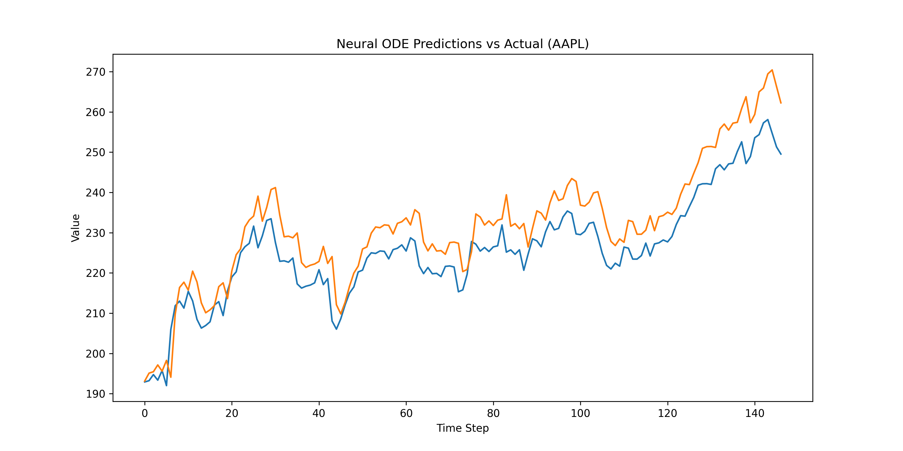

# Neural ODEs for Time-Series Forecasting

This project implements Neural Ordinary Differential Equations (Neural ODEs) to model and forecast time-series data. Neural ODEs can be applied to finance, physics, and electrical engineering data.

## Project Structure

- `generate_dataset.py` – Generates synthetic time-series datasets (`data/sample_large.csv`).  
- `view_model.py` – Basic script to view predictions on `sample_large.csv`.  
- `view_model_yfinance.py` – Downloads stock data from Yahoo Finance and visualizes predictions.  
- `view_model_combined.py` – Predicts and plots results using either Yahoo Finance or local datasets.  
- `src/train.py` – Trains Neural ODE on a dataset and saves model to `results/`.  
- `src/data.py` – Loads CSV, normalizes data, and splits into sequences for training/testing.  
- `src/eval.py` – Evaluates model on test data.  
- `src/models/neural_ode.py` – Implements Neural ODE architecture.  
- `src/models/odefunc.py` – Defines the ODE function used in Neural ODE.  
- `src/models/latent_ode.py` – Latent Neural ODE (advanced architecture).  
- `src/models/cde_model.py` – Neural Controlled Differential Equation model.  
- `src/models/lstm.py` – LSTM baseline model.  
- `data/` – Folder containing CSV datasets (e.g., `sample_large.csv`, `aapl.csv`).  
- `results/` – Saves trained models (`.pt`) and prediction plots (`.png`).  
- `LICENSE` – MIT License.  
- `requirements.txt` – Python dependencies.  

## Setup

1. Activate virtual environment:
```bash
source venv/bin/activate
```

2. Install dependencies:
```bash
pip install -r requirements.txt
```

3. Run scripts in src/ to preprocess data, train models, and evaluate results.

## Results 

### 1. Data Handling
- This project works with **any time-series data** (finance, physics, electrical signals).  
- `src/data.py` handles:
  - Loading data from CSV
  - Normalizing values
  - Splitting into train/test
  - Creating sliding windows for sequence prediction  

Ensures **standardized input**, allowing the Neural ODE to learn patterns from any sequential data.

---

### 2. Model Training
- `src/train.py` trains the Neural ODE model on the dataset:
  - Converts data to PyTorch tensors
  - Defines the Neural ODE architecture (`src/models/neural_ode.py`)
  - Optimizes using Adam + MSE loss
  - Saves the trained model in `results/neural_ode_model.pt`  

Demonstrates the **training pipeline works** and generates a model capable of predicting sequences from new data.

---

### 3. Prediction and Evaluation
- `view_model.py`, `view_model_yfinance.py`, `view_model_combined.py`:
  - Loads the trained model
  - Predicts values on test data
  - Inverts normalization to original scale
  - Plots **predicted vs actual curves**
  - Saves results as PNG for easy visual comparison  

Provides clear evidence of how well the model learned the sequences.

---

### 4. Flexibility
- Users can:
  - Download **financial data** from Yahoo Finance (`view_model_yfinance.py`)
  - Train on **custom local datasets** (`sample_large.csv` or any CSV)
  - Apply to **electrical signals** or **physics experiments**  
- Hyperparameters like `window_size`, `hidden_size`, and `epochs` are easily adjustable.

Shows that the project is **general-purpose** for time-series forecasting.

---

### 5. Project Organization
- `generate_dataset.py` → Generate synthetic datasets quickly for testing  
- `src/models/` → Contains modular model components (LSTM, ODE functions, latent ODE, etc.)  
- `results/` → Saves trained model weights and prediction plots  

Allows a new user to **run the project end-to-end** without missing steps.

---

### 6. How Results Are Verified
- **Visual check:** Prediction plots (`pred_vs_actual_*.png`) show if predicted curves follow actual data.  
- **Numerical check:** First 10 predicted vs actual values are printed.  
- **Scalability check:** Handles small synthetic datasets (`sample.csv`) to large financial datasets (`yfinance` or `sample_large.csv`).  

Demonstrates **both correctness and usability**.

## Results

### Example: AAPL Predictions


### Example: Local Dataset Predictions


